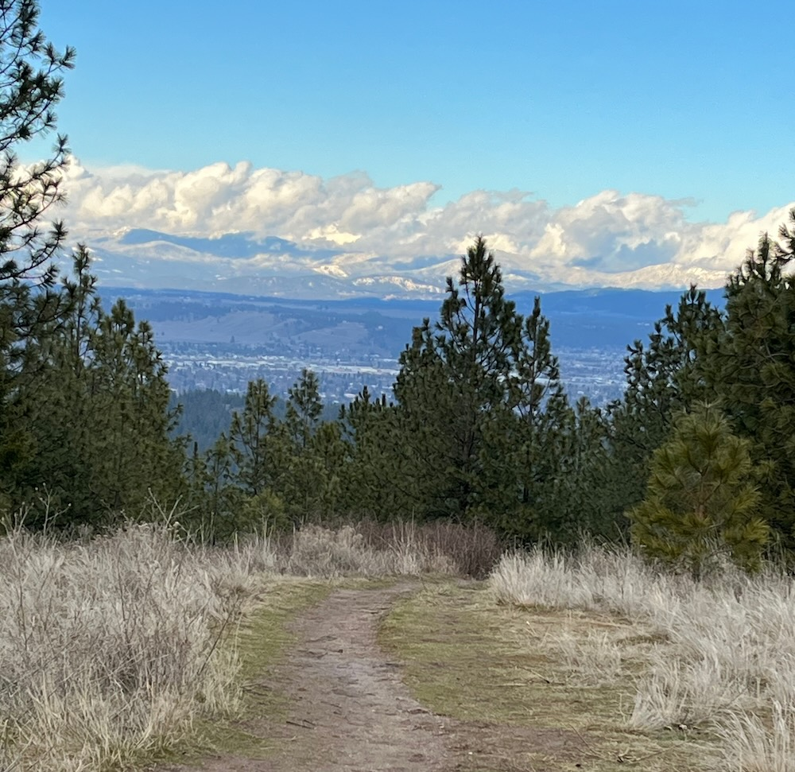

Wecome to my data science and analytics blog dedicated to expanding on what I learned in my data science bootcamp with NYC Data Science Academy.

A little bit about me... 

I am a professional violinist in Spokane, Washington, with a long-ago background in Physics. I am exploring career opportunities in data science and am eager to learn new things.

A long time ago, I earned a Bachelor's of Science degree in Physics from the University of Rochester and was a music major in violin performance at the Eastman School of Music, although I did not complete a music degree. I took lessons as a meditative diversion from my physics studies and never considered performance as a viable occupation. When I graduated, I spent some time working at the Los Alamos National Laboratory before realizing that I love music and was not ready to give up that part of my life for graduate school. I auditioned for and got into the Santa Fe Symphony and then the Spokane Symphony Orchestra, where I have spent the last two decades as a professional violinist.  

The pandemic was a turning point for me, leaving me anxious about my chosen field and our culture's commitment to supporting arts institutions. I decided it was time to put some effort behind my curiosity for other things. I have always been interested in writing and science and earned a certificate in Technical Writing from the University of Washington. I thought I would dislike coding (HTML) and was suprised to find that it is kind of fun. With my background, it was not hard to see that data science might be fun too.  

In the summer of 2024, I jumped into the NYC Data Science Bootcamp with Machine Learning and chipped away at this new challenge. I learned how to program in Python and how to visualize and talk about data. I made a dashboard app featuring data I scraped from a string instrument auction website. I learned about linear regression and classification and decision tree models. I gave presentations on my findings. Broadly, I learned that people can do amazing things with data. 

In addition to performing with the Spokane Symphony Orchestra, I am currently working part-time as a billing specialist and data analyst for a small biotech company that specializes in IVF services for cattle. I enjoy the partnership of digging into data with businesses, seeing how data drives decisions and and improve efficiency. There is so much opportunity to support what small businesses already do well, tailoring meaningful tools to help them with planning and logistics. It is an exciting space to be in.     

Thanks for reading,

Margaret

